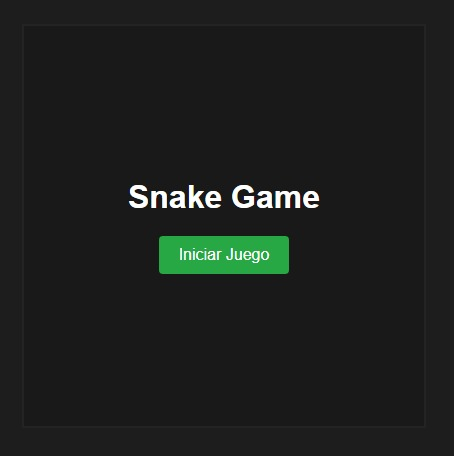
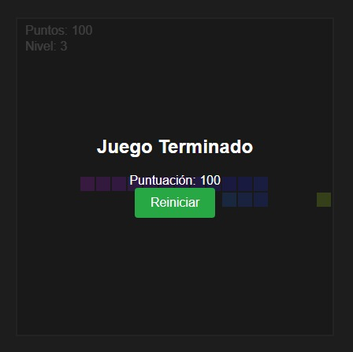
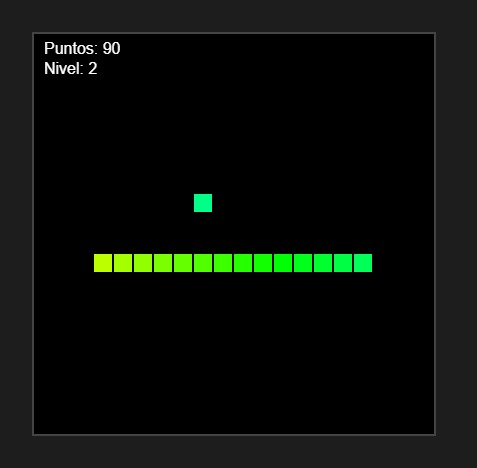

# Snake Game

Un clásico Snake modernizado con niveles, puntuación, animaciones de color y controles de pausa y reinicio.

---

## Capturas

  

 

  


---

## Niveles

Los niveles muestran tu progreso y pueden influir en la jugabilidad.  
Cada 5 manzanas, subes un nivel:  
- Nivel 1: cola de 5 a 9  
- Nivel 2: cola de 10 a 14  
- Nivel 3: cola de 15 a 19  

Fórmula interna:

```
level = Math.floor(tailLength / 5)
```

---

## Mecánicas por nivel

- Aumentar velocidad:  
  ```js
  this.fps = 15 + this.level * 2;
  this.frameInterval = 1000 / this.fps;
  ```

---

## Instalación

1. Clona el repositorio  
2. Abre `snake.html` en tu navegador

---

## Controles

- Flechas: mover serpiente  
- P: pausar/reanudar  
